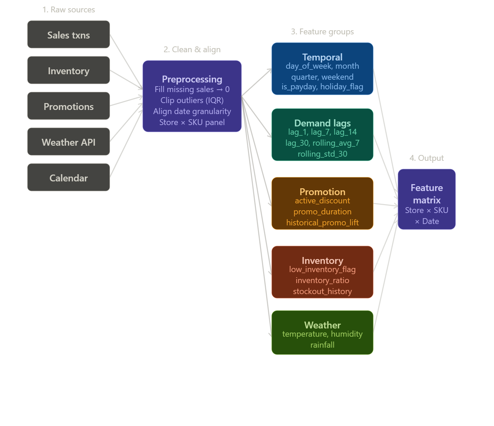

### Objective:

To predict the **daily units sold** (`Units Sold`) for every product in each store using historical sales patterns, inventory levels, price fluctuations, promotions, holidays, and weather conditions.

This helps **SmartRetail Corp.** prepare ahead for demand surges, reduce stockouts, and plan logistics efficiently.

```

```

### Modeling Approaches:

1. **Statistical Methods**
    
    - ARIMA/SARIMA: Good for low-granularity forecasting
        
    - Prophet (by Meta): Captures trends + seasonality well
        
2. **Machine Learning Models**
    
    - XGBoost, LightGBM: Handle mixed data well, especially with feature engineering
        
    - Random Forest Regressors with lag and external features
        
3. **Deep Learning**
    
    - **LSTM/GRU**: Capture sequential dependencies in time series
        
    - **Temporal Convolutional Networks**: More scalable for parallelism
        
    - Attention-based models for multi-series forecasting
        

---

### Evaluation Metrics:

- **Root Mean Square Error (RMSE)**
    
- **Mean Absolute Percentage Error (MAPE)**
    
- **Symmetric MAPE (sMAPE)**
    
- **WAPE** (Weighted Absolute Percentage Error)
    

---

### Expected Deliverables:

- Daily demand forecasts for each product-store pair
    
- Forecasting dashboards for planning teams
    
- Alerts for predicted stockouts or demand spikes
    
- Seasonality and trend insights by product category